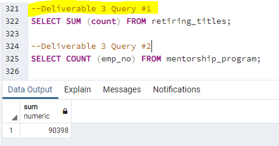
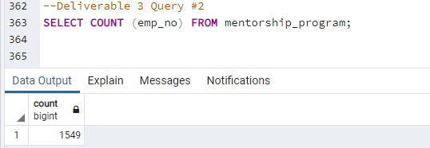

# Pewlett-Hackard-Analysis

## Overview of the analysis: 

The purpose of this analysis is to provide a list of employees who will be eligible for the PH mentorship program at the time of their retirement. This will help future-proof PH given the impending 'silver tsunami'.

## Results: Provide a bulleted list with four major points from the two analysis deliverables.
Four major points from the two analysis deliverables include:
- There is a total number of 90,398 retiring employees by title.
- There are a total of 7 unique titles associated with retiring employees by title.
- There are 1,549 retirees who qualify for the mentorship program based on their birth year of 1965.
- PH has to prepare to fill 90,398 future roles that will be made available because current employees are due to retire. 

## Summary: 
1. How many roles will need to be filled as the "silver tsunami" begins to make an impact?
There are 90,398 roles that need to filled as the "silver tsunami" begins to make an impact. The following image shows the summation of the total number of retirees based on unique titles:

2. Are there enough qualified, retirement-ready employees in the departments to mentor the next generation of Pewlett Hackard employees?
There are only 1,549 eligibile mentors in the mentorship program. There are *not* enough qualified, retirement-ready employees in the departments to mentor the next generation of PH employees. 

